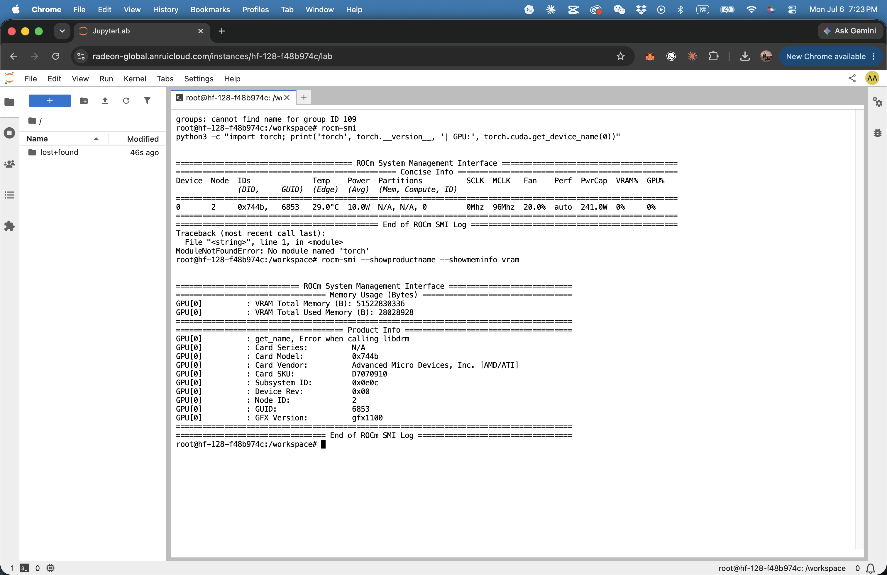
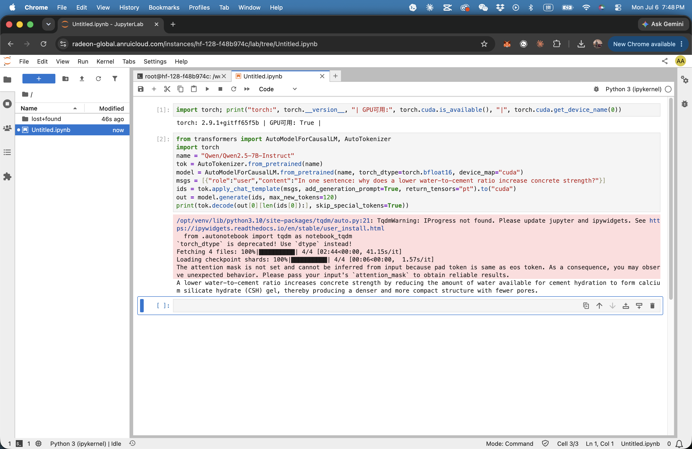

# AMD compute — usage evidence

MixMind's brain is self-hosted on an AMD GPU (ROCm). Track 3 requires demonstrating AMD
compute use; this page collects the proof. (Automated pre-screening inspects the repo, the
slide deck, and the live URL — so the evidence lives here in the repo, not only in the video.)

## Hardware — AMD Radeon PRO W7900 (RDNA3 / gfx1100, 48 GB)

`rocm-smi` on the hackathon notebook:
- **Card Vendor:** Advanced Micro Devices, Inc. [AMD/ATI]
- **GFX Version:** gfx1100 (RDNA3)
- **VRAM:** 51,522,830,336 B ≈ **48 GB**
- Environment: ROCm 7.2 + PyTorch + vLLM + Unsloth + llama.cpp (for Radeon)

## LLM inference on the AMD GPU

`torch.cuda.is_available() → True` on the AMD device (ROCm exposes the `cuda` namespace), and an
open model (Qwen 2.5-7B / then Gemma 4-12B) loaded and answered a concrete-engineering question
**entirely on the W7900**. The same path serves the fine-tuned Gemma 4 that powers the Copilot and
the Mix Committee.

## What runs on AMD
- **Inference** — Gemma 4 (12B), self-hosted, serving the Copilot + Committee (`src/serve.py`).
- **Fine-tuning** — LoRA via PEFT on the same GPU (`data/finetune/train_lora.py`).
- **Deployment reality** — the fine-tuned model is small enough to serve on a single Radeon card,
  which is the point: private, on-prem AI at ~$4k of hardware, not a data-center box.

*Note: the platform assigned a Radeon PRO W7900, not an MI300X — still AMD compute, and on-message
for affordable on-prem deployment. All materials say "AMD Radeon", never "MI300X".*
